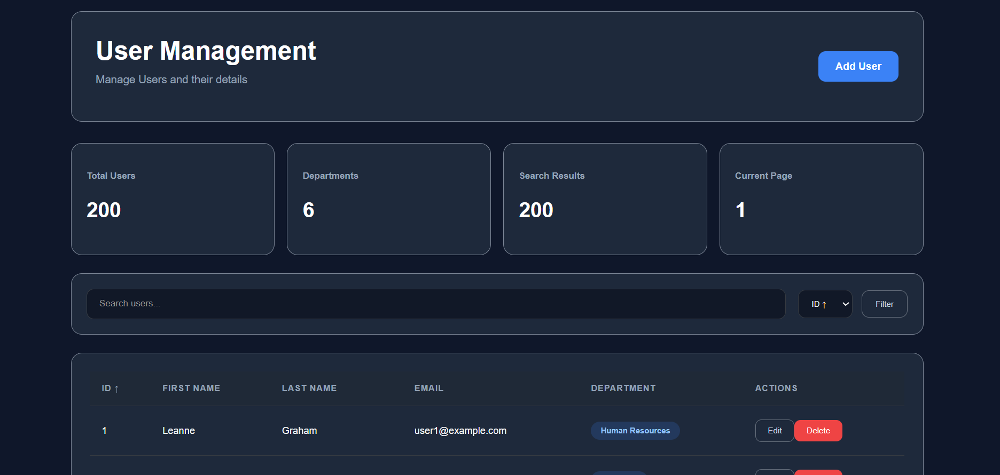
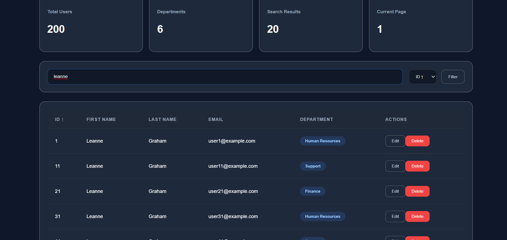
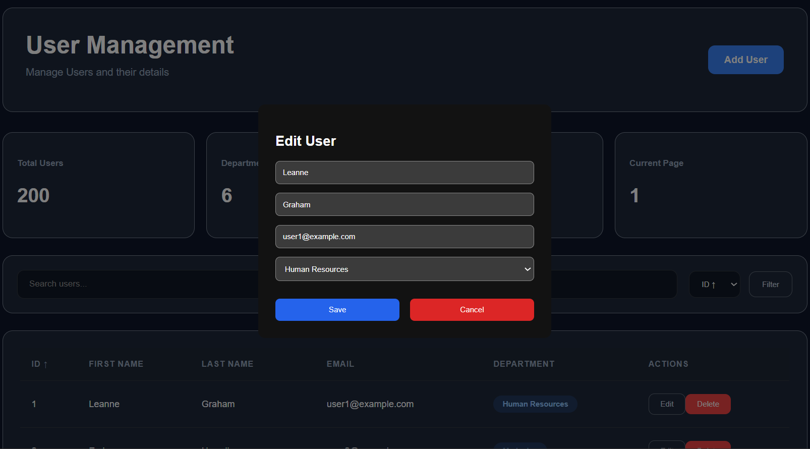
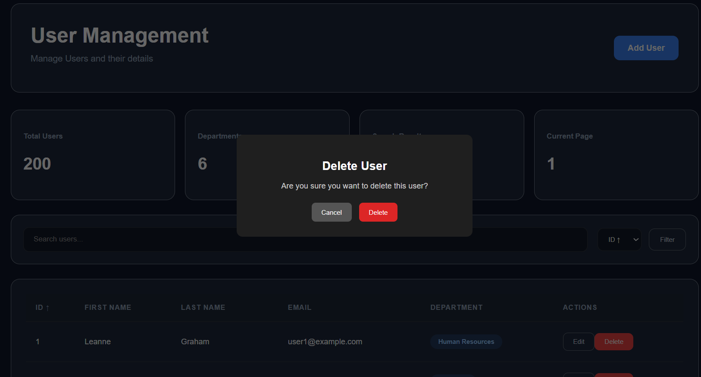
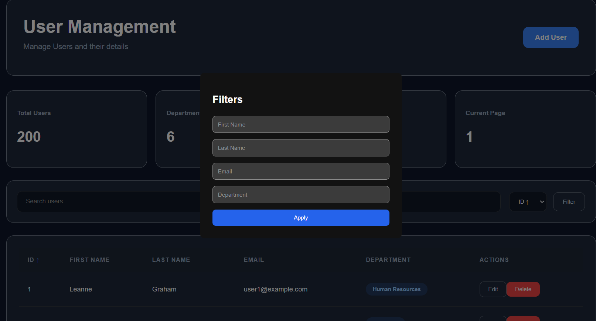

# 🚀 User Management Dashboard

A modern, responsive **React + Vite User Management Dashboard** built for the **Ajackus Frontend Assignment**.

The application allows users to manage employee records with features such as searching, sorting, filtering, pagination, CRUD operations, responsive UI, toast notifications, and modern dashboard styling.

---

# 🌐 Live Demo

🔗 https://ajackus-user-dashboard-two.vercel.app/

---

# 📂 GitHub Repository

🔗 https://github.com/kushhhwanth/ajackus-user-dashboard

---

# 📸 Screenshots

## Dashboard



## Add User



## Edit User



## Delete Confirmation




## Filter Users



---

# ✨ Features

## ✅ User Management

- View users in a clean dashboard
- Add new users
- Edit existing users
- Delete users
- Duplicate user validation
- Duplicate email validation

---

## 🔍 Search

Search users by:

- First Name
- Last Name
- Email

Results update instantly while typing.

---

## 📊 Sorting

Sort users by

- ID Ascending
- ID Descending
- Name A-Z
- Name Z-A

---

## 🎯 Filtering

Filter users using:

- First Name
- Last Name
- Email
- Department

---

## 📄 Pagination

Supports:

- 10 Users/Page
- 25 Users/Page
- 50 Users/Page
- 100 Users/Page

Includes

- Previous Page
- Next Page
- Current Page Indicator

---

## 🔔 Notifications

Uses **React Toastify**

Notifications for

- User Added
- User Updated
- User Deleted
- Validation Errors

---

## 🧾 Form Validation

Validates

- Required fields
- Duplicate emails
- Duplicate users

Prevents invalid submissions.

---

## 🎨 Modern UI

Features

- Dark theme dashboard
- Responsive layout
- Rounded cards
- Hover animations
- Modern buttons
- Responsive table
- Department badges
- Empty state
- Loading state

---

# 🛠️ Tech Stack

## Frontend

- React 19
- Vite
- JavaScript (ES6+)

## Styling

- CSS3
- Flexbox
- Responsive Design

## HTTP Client

- Axios

## Notifications

- React Toastify

## Version Control

- Git
- GitHub

## Deployment

- Vercel

---

# 📁 Project Structure

```
src
│
├── components
│   ├── ConfirmDialog
│   ├── FilterModal
│   ├── Loader
│   ├── Navbar
│   ├── Pagination
│   ├── SearchBar
│   ├── UserForm
│   └── UserTable
│
├── hooks
│   └── useUsers.js
│
├── pages
│   └── Dashboard
│
├── services
│   └── api.js
│
├── utils
│   └── department.js
│
├── App.jsx
└── main.jsx
```

---

# ⚙️ Installation

Clone the repository

```bash
git clone https://github.com/kushhhwanth/ajackus-user-dashboard.git
```

Move inside the project

```bash
cd ajackus-user-dashboard
```

Install dependencies

```bash
npm install
```

Run development server

```bash
npm run dev
```

Build production version

```bash
npm run build
```

Preview production build

```bash
npm run preview
```

---

# 📌 Available Scripts

| Command | Description |
|----------|-------------|
| npm run dev | Start development server |
| npm run build | Create production build |
| npm run preview | Preview production build |

---

# 📦 Dependencies

```json
React
React DOM
Axios
React Toastify
Vite
```

---

# 📋 Functionalities

## Add User

- Opens modal
- Validates input
- Prevents duplicate users
- Prevents duplicate emails
- Adds user to table
- Shows success notification

---

## Edit User

- Opens form with existing values
- Updates selected user
- Displays success toast

---

## Delete User

- Confirmation dialog
- Deletes selected user
- Updates UI immediately
- Shows success toast

---

## Search

Supports searching using

- First Name
- Last Name
- Email

Automatically resets pagination.

---

## Filter

Filter using

- First Name
- Last Name
- Email
- Department

---

## Sorting

Sort by

- ID ↑
- ID ↓
- A-Z
- Z-A

---

## Pagination

Supports

- Dynamic page size
- Navigation
- Page count

---

# 🎯 Assignment Requirements Covered

| Requirement | Status |
|-------------|---------|
| React | ✅ |
| Functional Components | ✅ |
| Hooks | ✅ |
| Axios API Calls | ✅ |
| Search | ✅ |
| Sorting | ✅ |
| Filtering | ✅ |
| Pagination | ✅ |
| CRUD Operations | ✅ |
| Responsive UI | ✅ |
| Validation | ✅ |
| Modern Design | ✅ |
| Notifications | ✅ |
| Deployment | ✅ |

---

# 🌐 API Used

JSONPlaceholder

```
https://jsonplaceholder.typicode.com/users
```

Used for

- Fetch Users
- Simulated CRUD

---

# 🚀 Performance Optimizations

- Component-based architecture
- Reusable UI components
- Custom hook for filtering/sorting
- Efficient state updates
- Client-side pagination
- Optimized rendering

---

# 📱 Responsive Design

Optimized for

- Desktop
- Laptop
- Tablet
- Mobile

---

# 🔒 Validation Rules

- Email must be unique
- Duplicate users are not allowed
- Required fields cannot be empty

---

# 🎨 UI Components

- Dashboard Header
- Search Bar
- Filter Modal
- User Table
- Add/Edit Modal
- Confirmation Dialog
- Pagination
- Toast Notifications

---

# 📈 Future Improvements

- Authentication
- Role-based access
- Backend integration
- Database persistence
- CSV Export
- PDF Export
- Bulk Delete
- Dark/Light Theme Toggle
- Advanced Filters
- User Profile Images
- Server-side Pagination
- Unit Testing
- Docker Support

---

# 👨‍💻 Author

**Kushvanth**

GitHub

https://github.com/kushhhwanth

---

# 📄 License

This project was developed as part of the **Ajackus Frontend Developer Assignment**.

Free to use for learning purposes.

---

# ⭐ Acknowledgements

- React
- Vite
- Axios
- React Toastify
- JSONPlaceholder API
- Vercel
- GitHub

---

## 🎉 Thank You

Thank you for reviewing this project!

If you found it helpful, consider giving the repository a ⭐ on GitHub.